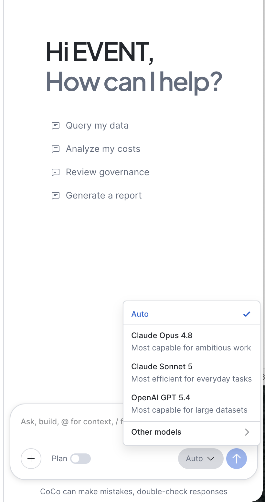
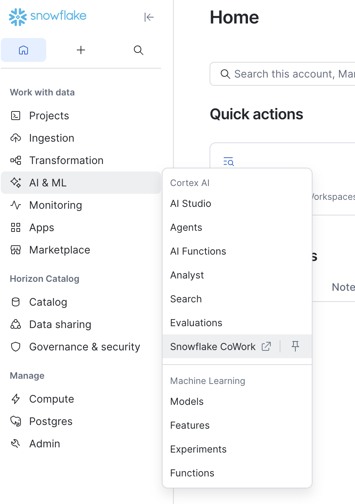

# Pricing Dislocation — CoCo Hands-On Lab

A hands-on lab for **CoCo** that you can run three ways — the **CoCo CLI**, **CoCo Desktop**, or **CoCo in Snowsight** (Cloud Agents). You stand up a governed, agentic pricing-dislocation workload in your own Snowflake account, then explore it, extend it, and govern it — all from CoCo. Business users consume the finished agent in **Snowflake Cowork**.

The lab is identical in every environment: the same repo, the same `dislocation-lab` skill for set, and the same one-command deploy (`./setup.sh`). Only three things differ by environment — how you get the repo in front of CoCo, how CoCo authenticates to Snowflake, and how you open the finished agent. Those differences are summarized once below and called out inline where they matter.

> **First time?** See the [Setup & Reference appendix](#appendix-setup--reference) for one-time configuration, including [Running in Snowsight (Cloud Agents)](#running-in-snowsight-cloud-agents).
>
> **Returning to run it again?** Open CoCo in the project directory (or workspace) and tell it to *"reset the lab"*. The `dislocation-lab` skill handles the rest.

> **What is pricing dislocation?** For an insurer, *dislocation* is the shift in premium that individual policyholders experience when the carrier moves from its current rating plan to a proposed one. Even a revenue-neutral filing rarely moves everyone equally, so insurers analyze dislocation *before* deploying a new plan — large increases drive non-renewal, regulators cap per-policy swings, and impact can concentrate in a segment or geography. This lab scores that risk across a synthetic multi-state property book by combining proposed rate change with lapse propensity, loss experience, and competitive position.

---

## Choose your environment

CoCo is one assistant with three front ends. Pick whichever matches how you work — the lab runs the same in all three.

| | **CoCo CLI** | **CoCo Desktop** | **CoCo in Snowsight (Cloud Agents)** |
|---|---|---|---|
| **What it is** | `cortex` in your terminal | The CoCo desktop app | The CoCo side panel in Snowsight, backed by a Cloud Agents container |
| **Get the repo in** | `git clone` locally | `git clone` locally | Create a **Git-synced workspace** (*From Git repository*) |
| **Snowflake auth** | Named connection in `~/.snowflake/connections.toml` (`CLI_CONNECTION_NAME`) | Same as CLI | **Ambient Snowsight session** via the pre-wired `default` connection — leave `CLI_CONNECTION_NAME=default` |
| **Shell / deploy** | Full shell → `./setup.sh` | Full shell → `./setup.sh` | Cloud Agents gives a full shell → the skill runs `./setup.sh` for you |
| **Ask the agent** | `cortex agents run …` | `cortex agents run …` | Open the agent in **Snowflake Cowork** (AI & ML » Agents) |
| **Git** | local `git` CLI | local `git` CLI | `git` in the container **or** the Workspaces Git UI |

**Cloud Agents** (Public Preview, Commercial/KSA) runs each Snowsight CoCo session in an isolated container with a real shell, Python, the snow CLI and web search — so `./setup.sh`, `snow`, `python3`/snowclisp, `git`, and `cortex` all work exactly as they do on the CLI. See [Running in Snowsight (Cloud Agents)](#running-in-snowsight-cloud-agents) for details and caveats.

---

## Lab Script

**Scenario:** You're standing up an agentic dislocation-analysis workload for a P&C insurer. You'll deploy it, interrogate the data and the governed semantic layer, ask a deployed agent business questions, extend the model, and prove governance — all from CoCo.

**Repo:** [https://github.com/sfc-gh-dgillis/coco-dislocation-hol](https://github.com/sfc-gh-dgillis/coco-dislocation-hol)

---

## Pre-Lab Checklist

Run through this before each walkthrough to ensure a clean starting state. Do the onboarding for your environment, then the shared steps.

**Snowflake DataOps.live Hands-on Lab**

Your environment is pre-configured. 

1. Login to Snowsight using your given username and password.
2. Navigate in Snowsight to Workspaces → coco-dislocation-hol, and you will see the fully populated code repository.

**CLI / CoCo Desktop**

1. `git clone` the repo and open CoCo in the `coco-dislocation-hol` project root.
2. Confirm `.env/dislocation.env` has `CLI_CONNECTION_NAME` set to your connection (see [Deploy](#deploy)).

**Snowsight (Cloud Agents)**

1. Create a **Git-synced workspace** from the repo URL (Projects » Workspaces » *From Git repository*; needs an API integration). See [Running in Snowsight](#running-in-snowsight-cloud-agents). If using this within a dataops.live lab, this is all handled for you and should be pre-existing.
2. Open the **CoCo** side panel — the Cloud Agents container starts automatically.
3. Leave `.env/dislocation.env` with `CLI_CONNECTION_NAME=default` (the ambient Snowsight session).
4. Switch role to ACCOUNTADMIN. 

> **Important:** Don't run `./setup.sh` before the walkthrough — Act 1 deploys live as a demo moment.

---

## Lab Overview

**Data domain:** a synthetic multi-state property insurance book (FL, TX, LA, CA) — ~5,000 policies, 12 segments, 85 counties, two rate-filing scenarios.

**The arc follows five acts:**

- **Act 1 — Orientation & Deploy:** pick a model, explore the repo, deploy the whole stack via the `dislocation-lab` skill.
- **Act 2 — Explore the data & governed layer:** `$data-quality` on the seeded tables, `#` table mentions to inspect raw data and the scoring view, and `$lineage` to trace the semantic view back to sources.
- **Act 3 — Ask the agent:** question the deployed agent — in Snowflake Cowork (Snowsight) or via `cortex agents run` (CLI/Desktop) — and `cortex analyst query` against the semantic views.
- **Act 4 — Governance:** `$trust-center` for account security posture, RBAC role switch, dynamic PII masking, end-to-end role proof — the highest-priority act if you're short on time.
- **Act 5 — Extend, iterate & commit:** `/fork` a checkpoint, build the wrong thing, `/rewind` + clean up, save the convention to memory as a rule, rebuild correctly using an `@` style reference, `/compact`, then commit with an auto-generated message.

**Capabilities demonstrated:** built-in and custom skills (`$data-quality`, `$lineage`, `$trust-center`, `dislocation-lab`), `@` file mentions and `#` table mentions for context injection, direct SQL execution, `cortex agents run` / `cortex analyst query`, memory rules (`cortex memory`), session guardrails / RSS (`/guardrails`), git, session management (`/model`, `/fork`, `/rewind`, `/compact`), and iterative problem-solving.

---

## Act 1 — Orientation & Deploy

> **Story:** Understand what the repo deploys, then stand up the full stack in one command.

### Prompt 1 — Choose a model

CoCo supports multiple LLM models. Choose the model that best fits your use case. 

{: style="width:500px; display: block; margin-left: auto; margin-right: auto;"}

- **CoCo Desktop / Snowsight** - Use the model selector in the prompt dialogue box
- **CLI** - Choose the model by using a `/model` and selecting from the text menu

```text
/model claude-opus-4-8
```

**Expected:** CoCo switches models.

### Prompt 2 — Explore the project

Input the following prompt to explore the project.

```text
What does this lab deploy, and how does the agent get its skills?
```

**Expected:** CoCo will describe the build process through `setup.sh` as well as how the agent gets its skills from the skills directory.

Get details about the agent deployment sql, input the following prompt:

```text
@sql/005-agent.sql Talk to me about this file - what is it doing?
```

**Expected:** The `@` prefix injects each file's contents directly into the prompt — no copy-paste. CoCo summarizes the agent structure.

### Prompt 3 — Deploy the lab

> **Mad Skills!!!** CoCo ships with **built-in skills** (data-quality, lineage, trust-center, and more) and supports **custom skills**. This repo includes a project skill at `.cortex/skills/dislocation-lab/SKILL.md` that knows how to deploy, verify, reset, and drive this lab. Invoke a skill explicitly with `$` (e.g. `$data-quality`), or let CoCo auto-activate it. Run `/skill list` to see them all.

Issue the following prompt to set up the lab.

> If using Snowsight, be sure to switch your session role to ACCOUNTADMIN before running.

```text
Set up the dislocation lab in my Snowflake account.
```

**Expected:** The `dislocation-lab` activates and runs the deployment: it confirms `.env/dislocation.env` is configured, then runs `./setup.sh`, which executes `sql/001..007` in order via the `snowclisp` python program, uploads the 5 agent skills to the stage, exposes the agent in Snowflake Cowork, and verifies row counts, semantic views, skills-on-stage, and the Florida severity distribution. No commands to memorize.

> **In Snowsight:** identical — the Cloud Agents container runs `./setup.sh` for you. The `default` connection targets your ambient Snowsight session, so there's nothing to configure.
>
> If you'd rather not use the skill and run it yourself: edit `.env/dislocation.env` (set `CLI_CONNECTION_NAME`), then `./setup.sh`.

---

## Interlude — Anatomy of a skill

You just watched `dislocation-lab` deploy a whole environment from one sentence. That skill is not magic — it is a Markdown file. Understanding its shape is what lets you build your own.

### What a skill actually is

A skill is a folder containing a `SKILL.md` with two parts:

**Frontmatter** — a fenced block at the top with two fields:

```markdown
---
name: dislocation-lab
description: "Operate the Pricing Dislocation Coco hands-on lab in any environment — Coco CLI, Coco Desktop, or Coco in Snowsight (Cloud Agents). Use this skill whenever the user mentions: set up / deploy the lab, reset the lab, tear down, verify the deployment, ask the agent, dislocation analysis, dislocation score, retention risk, run the lab, the demo script, or any deploy/verify/governance operation in this project. Always use this skill for lab-related tasks even if the user doesn't say 'lab'."
---
```

- `name` — kebab-case identifier; this is what you type after `$` or `/`.
- `description` — **the most important field.** It is how CoCo decides whether to activate the skill at all. A good description says what it does, when to use it, and lists the everyday trigger phrases a teammate would actually type. Cast a wide net: "set up the lab" and "deploy the lab" should both land.

**Body** — plain Markdown teaching CoCo the job. Common sections:

- `## Workflow` — the ordered steps CoCo follows.
- `## Stopping Points` — where CoCo must pause and check in with a human.
- `## Output` — what "done" looks like.

Open `.cortex/skills/dislocation-lab/SKILL.md` and read it against that outline — same anatomy, aimed at Snowflake deployment.

### When a skill is worth building

The signal is **repetition with structure**: you do the same shaped task more than once, with different inputs each time. Standing up a pipeline the same way. Running the same pre-ship checks. Deploying a lab. A genuine one-off, or something open-ended and creative, is just clutter in your `/` picker.

Two rules before you start:

1. **Define the outcome.** The artifact your skill must produce every single time.
2. **Write down the steps first.** Even a rough ordered list — that way the skill encodes the workflow you actually run, not a guess at it.

And check whether it already exists. CoCo ships with a large built-in library (data-quality, lineage, trust-center, dynamic-tables, machine-learning, governance, cost — you have already used two of them in this lab):

```text
/find-skill is there already a skill for profiling a table's null rates?
```

### Build one from this lab

CoCo ships a built-in skill whose entire job is writing other skills. You do not hand-author `SKILL.md`.

```text
$skill-development I want a skill that profiles any table in DISLOCATION_DEMO.CORE and returns row counts, null rates, and distributions in a consistent format.
```

`skill-development` interviews you — name, purpose, triggers, any scripts — then **pauses for your confirmation** before writing anything. It proposes a structure, pauses again, then writes the files into your skills folder. There is no registration step; the skill appears the next time you open the picker.

The other direction is often better: capture work you already finished, while it is fresh.

```text
$skill-development Make a skill out of the dislocation analysis we just ran.
```

CoCo reads back through the session, extracts the repeatable workflow underneath it, and generalizes the specifics. You are not guessing at the steps — you are saving the ones that already worked. Any time you finish something here and think *I'll be doing this again*, that is the cue.

### Structure — the full skill folder

CoCo shares one context window across the whole conversation, so a lean, focused skill is a faster and more reliable skill. That is why detail lives in separate directories: CoCo loads them only when a step actually calls for them.

Everything except `SKILL.md` is optional:

```text
your-skill-name/
├── SKILL.md                  # Required - main skill file
├── scripts/                  # Optional - executable code
│   ├── process_data.py       # Example
│   └── validate.sh           # Example
├── references/               # Optional - documentation
│   ├── api-guide.md          # Example
│   └── examples/             # Example
└── assets/                   # Optional - templates, etc.
    └── report-template.md    # Example
```

Start with just `SKILL.md`. Add a directory when the skill actually needs it: `scripts/` when a step is deterministic enough to run as code rather than describe in prose, `references/` when detail is bulky or owned by someone else, `assets/` when the skill emits a document that should follow a fixed shape. For a job with clearly separate branches, keep `SKILL.md` as a thin router and give each branch its own subfolder with its own `SKILL.md`.

### Where skills live, by surface

Same invocation everywhere (`/`), different homes:

| | CoCo CLI | CoCo Desktop | Snowsight |
|---|---|---|---|
| **Location** | `.cortex/skills/` (project) or `~/.snowflake/cortex/skills/` (global) | `.snowflake/cortex/skills/` plus registered local folders | the workspace's `.snowflake/cortex/skills/` — workspace-scoped only |
| **Create** | `$skill-development`, or add a `SKILL.md` yourself | `$skill-development`, or Agent Settings → Skills → Add Local Skill | **+ Create Skill**, or Upload Skill File(s)/Folder(s) |
| **Invoke** | `/` or `$skill-name`; `/skill list` to browse | `/`, or let CoCo auto-match | `/` in the message box |
| **Share** | `cortex skill publish --to-stage`, a Git repo, or the catalog | Publish to Skills Catalog, or add from GitHub | `$share-skill` for a share link |

Desktop and the CLI read the same `~/.snowflake/cortex/skills.json`, so a skill added in one shows up in the other. Snowsight skills do not follow you out of the workspace.

### Share it, or nobody else gets it

A skill on your laptop only helps you. Publish to the [**Skills Catalog**](https://docs.snowflake.com/en/user-guide/cortex-code/cortex-code-snowsight/skills-and-plugins#skills-and-plugins-in-horizon-catalog) — Snowflake's governed registry in the Horizon Catalog, with access controlled by roles — and teammates find it with `$find-skill` and install in one step, all running the same version. If your toolkit grows past a couple of related skills, `plugin-creator` (Desktop) packages them into a single installable **plugin**.

### Iterate

Skills are living documents. Come back to `$skill-development` to **audit** one against best practices, **refactor** one that has grown too broad, or **extend** one with a new capability — describe the change and let CoCo rewrite the `SKILL.md`.

> **Source:** [Build Your First CoCo Skill](https://www.snowflake.com/en/developers/guides/build-a-coco-skill/) · [Create your own skill](https://docs.snowflake.com/en/user-guide/snowflake-cortex/cortex-code/skills) · [Skills & plugins in the Horizon Catalog](https://docs.snowflake.com/en/user-guide/cortex-code/cortex-code-snowsight/skills-and-plugins#skills-and-plugins-in-horizon-catalog)

---

## Act 2 — Explore the data & governed layer

> **Story:** Validate the data quality and trace how raw tables feed the scoring logic.

### Prompt 4 — Data quality scan

Invoke the data quality skill to perform a data quality scan. 

- **CLI** - Invoke skills with `$` - invoke data quality with: `$data-quality`
- **CoCo Desktop** - Use the skill selector in the prompt dialogue box
- **Snowsight** - Use `/` in the CoCo side panel to invoke the data-quality skill 

Input the following prompt after invoking the skill:

```text
Run a quick quality scan on the lab's dimension and fact tables in DISLOCATION_DEMO.CORE — null rates on key columns, row counts, and anything that looks off. Give me a plain-English summary.
```

**Expected:** The data-quality skill identifies the tables, runs targeted null/row-count/anomaly checks, and returns a plain-English health summary — no handwritten SQL.

### Prompt 5 — Inspect the raw data

You can use CoCo to do ad-hoc analysis in natural language.

- **CLI:** - Use # to search through databases and schemas rapidly. 
- **CoCo Desktop / Snowsight:** - Use the Database Explorer to browse db objects

Input the following prompt:

```text
#DISLOCATION_DEMO.CORE.DIM_POLICY What does the policy data look like, and how many policies exist per state?
```

**Expected:** It describes the table and runs a per-state count against Snowflake.

### Prompt 6 — Trace lineage

Input the following prompt:

```text
$lineage Show the full lineage of DISLOCATION_DEMO.CORE.VW_DISLOCATION_ANALYSIS.
```

**Expected:** The lineage skill maps `7 DIM_*/FACT_* tables → VW_DISLOCATION_ANALYSIS → SV_DISLOCATION`, showing the adapter view reads from all seven base tables and feeds the semantic view the agent consumes.

### Prompt 7 — Understand the scoring view

```text
#DISLOCATION_DEMO.CORE.VW_DISLOCATION_ANALYSIS Explain how the dislocation score is calculated and what the severity bands mean.
```

**Expected:** With the view's columns injected, CoCo explains the weighted composite (rate change, lapse, loss ratio, concentration, competitive position) and the CRITICAL/HIGH/MEDIUM/LOW bands.

---

## Act 3 — Ask the Agent

> **Story:** Put the deployed agent to work — ask business questions and get answers from the governed semantic layer.

The deployed agent is `DISLOCATION_DEMO.CORE.DISLOCATION_ANALYSIS_AGENT`. `setup.sh` already exposed it in **Snowflake Cowork** (step `007-cowork.sql`), so it's reachable two ways.

**In Snowsight:** navigate to **Snowflake Cowork** (or directly with [ai.snowflake.com](https://ai.snowflake.com)) — select `DISLOCATION_ANALYSIS_AGENT`, and ask the prompts below in the chat UI.

{: style="width:500px; display: block; margin-left: auto; margin-right: auto;"}

**On the CLI / CoCo Desktop:** reach the same agent with `cortex agents run` (tip: prefix a command with `!` inside a CoCo session to run it in-line, or use a second terminal).

### Prompt 8 — Find dislocation

Input the following prompt in Cowork:

```text
Find pricing dislocation in Florida property
```

or from a shell:

```shell
cortex agents run DISLOCATION_DEMO.CORE.DISLOCATION_ANALYSIS_AGENT "Find pricing dislocation in Florida property"
```

**Expected:** A ranked table of FL segments with scores, severity bands, rate changes, and lapse propensity — plus drivers and implications. The agent routed to the `dislocation-score` skill.

### Prompt 9 — Compare states & explain drivers

Input the following prompt in Cowork:

```text
Compare dislocation risk across all states
```

or from a shell:

```shell
cortex agents run DISLOCATION_DEMO.CORE.DISLOCATION_ANALYSIS_AGENT "Compare dislocation risk across all states"
```

Input the following prompt in Cowork:

```text
Why is Louisiana showing so many critical segments?
``

or from a shell:

```shell
cortex agents run DISLOCATION_DEMO.CORE.DISLOCATION_ANALYSIS_AGENT "Why is Louisiana showing so many critical segments?"
```

**Expected:** A state-by-state comparison, then a driver decomposition — same framework, different peril mechanisms per state.

### Prompt 10 — Query the semantic view directly

You can also query a semantic view directly from a CoCo panel in Snowsight. Input the following prompt in CoCo:

```text
query SV_DISLOCATION with Cortex Analyst
```

or from a shell:

```shell
cortex analyst query "Which segments combine the highest rate increase with the highest lapse propensity in Florida?" --view DISLOCATION_DEMO.CORE.SV_DISLOCATION
```

**Expected:** Cortex Analyst answers straight off the governed semantic layer — the same logic the agent uses, no agent hop.

---

## Act 4 — Governance

> **Story:** The data is live and the agent answers questions — now show that access controls actually enforce what they claim.

### Prompt 11 — Check the account's security posture

Governance starts with knowing where you stand. Invoke the Trust Center skill to summarize Snowflake's built-in security scanners for the whole account.

- **Snowsight:** use `/` in the CoCo side panel to invoke the trust-center skill
- **CoCo Desktop:** use the skill selector in the prompt dialogue box
- **CLI:** invoke with `$trust-center`

```text
$trust-center Summarize the current security findings for my account — list anything CRITICAL or HIGH by severity, and note whether the checks relevant to this lab (roles and grants) look clean.
```

**Expected:** The trust-center skill reads Snowflake's Trust Center scanners (Security Essentials is on by default) and returns a prioritized, plain-English summary of findings by severity — account-wide posture before we drill into this lab's RBAC and masking.

### Prompt 12 — Show RBAC differences

```text
Show that DISLOCATION_DIRECTOR_RL can query VW_DISLOCATION_ANALYSIS but not DIM_POLICY, and that DISLOCATION_ANALYST_RL can query both.
```

**Expected:** CoCo runs the role-scoped queries (`USE ROLE …; USE SECONDARY ROLES NONE; …`) and shows the Director blocked on raw tables while the Analyst has full access — governance enforced by Snowflake's RBAC, not app code.

### Prompt 13 — Dynamic PII masking

```text
Apply the optional PII masking module, then show the same Florida claims query as the Analyst vs the Director role.
```

**Expected:** CoCo runs `sql/optional-pii_masking.sql`, then the same query returns full claimant/attorney names for the Analyst and `●●●● REDACTED ●●●●` for the Director — same rows, same financials, names masked at the platform layer. This is Snowflake Dynamic Data Masking: a policy applied once, enforced everywhere, regardless of how the data is accessed.

### Prompt 14 — Prove the roles hold end-to-end

Combine what you've seen. Switch to the Director role and try to access both the governed agent and a raw table in the same turn:

```text
USE ROLE DISLOCATION_DIRECTOR_RL; Now query VW_CLAIMS_DETAIL for Florida claims over $50K — then try selecting directly from DIM_POLICY.
```

**Expected:** The view query succeeds (the Director has SELECT on adapter views), but the direct table query fails with an *insufficient privileges* error. The Director can consume governed data products — views, semantic views, the agent — but cannot bypass them to reach raw tables. Switch back to your admin role when done:

```text
USE ROLE ACCOUNTADMIN;
```

> **CLI / CoCo Desktop (optional) — Put CoCo on a leash with guardrails (RSS):**
> RBAC governs what *roles* can do; **Guardrails** govern what *CoCo itself* can do in a session — a Restricted Session Scope (RSS) enforced by Snowflake, above RBAC. Run `/guardrails`, activate **SQL read-only**, then ask CoCo to `Drop the VW_DISLOCATION_ANALYSIS view.` — it refuses with a *"Restricted session scope"* error. RSS is a CLI/Desktop capability today; in Snowsight, the RBAC and masking controls above are your enforcement layer.

---

## Act 5 — Extend, iterate & commit

> **Story:** Add a new metric, break it on purpose, undo the damage, then rebuild it correctly and commit.

> **In Snowsight:** the session-management commands below (`/fork`, `/rewind`, `/compact`) and the `!` inline-command trick are CLI / CoCo Desktop conveniences. In the CoCo panel, use the equivalent panel controls (new chat, plan mode, clear) — the *modeling* steps (build, undo the side effects, rebuild) work identically.

> **Heads up:** if you activated the read-only guardrail in Act 4, deactivate it via `/guardrails` first — the build steps below write to Snowflake.

### Prompt 15 — Fork a checkpoint

```
/fork before-new-view
```

**Expected:** CoCo branches the *session* (like `git branch` for your conversation). If the next steps go wrong, you can return to this exact state.

### Prompt 16 — Build the wrong thing (intentional)

```
Create a view called premiumatrisk that sums premium delta by county. Just make it quickly.
```

**Expected:** CoCo builds it — but it breaks conventions (no `VW_` prefix, unqualified, not templated). We're about to undo it.

### Prompt 17 — Rewind and clean up

```
/rewind 1
```

Then:

```
Delete anything that "premiumatrisk" prompt created — drop the view in Snowflake and remove any file.
```

**Expected:** `/rewind` rolls back the *conversation*; the follow-up cleans the *side effects* (dropped view, removed file). Note the distinction: `/rewind` is destructive to conversation only — files/tables/commits need explicit cleanup.

### Prompt 18 — Teach CoCo the convention (memory)

The `premiumatrisk` mistake was avoidable. Instead of restating conventions on every prompt, save them once — CoCo's memory persists across sessions and enforces rules on every future turn.

```text
Remember as a rule: adapter views must use the VW_ prefix, fully-qualified names, and <% ctx.env.X %> templating — never hardcode DISLOCATION_DEMO.
```

**Expected:** CoCo stores it as an enforced rule (`cortex memory remember … --rule`) and confirms. You can list saved rules with `cortex memory list --rule`.

> **All environments:** memory works the same on CLI, Desktop, and Snowsight. Add `-g` to make a rule global across every project, not just this lab.

### Prompt 19 — Rebuild correctly

```
@sql/003-views.sql Create a new adapter view VW_PREMIUM_AT_RISK that totals PREMIUM_DELTA and policy count by STATE and COUNTY for the current scenario, matching the structure of the views in this file. Then compile it.
```

**Expected:** Notice this prompt doesn't repeat the naming or templating rules — it doesn't need to. CoCo applies them from the rule you just saved, uses the file as a structural reference, and produces a `<% ctx.env.X %>`-templated, `VW_`-prefixed `VW_PREMIUM_AT_RISK`, then compiles it.

### Prompt 20 — Compact the session

```
/compact
```

**Expected:** CoCo condenses the conversation history, preserving state (branch, what was built) while freeing context. Use it proactively during long sessions.

### Prompt 21 — Commit

```
Commit all changes with an appropriate message.
```

**Expected:** CoCo stages the new/modified files and writes a well-formed commit message summarizing the work.

> **In Snowsight:** CoCo can commit and push from the container's `git`, or you can review the diff and push from the Workspaces **Changes** tab.

---

## Capstone — Snowflake Cowork

If you asked the agent from the CLI or CoCo Desktop, close the loop by opening the **same agent** in **Snowflake Cowork** — Snowsight » AI & ML » Agents — select `DISLOCATION_ANALYSIS_AGENT`, and ask *"Find pricing dislocation in Florida property."* This is the business-user experience for the exact agent you built. (Snowsight participants already did this in Act 3.)

---

## Closing Points

1. **From zero to governed agent**, in whichever CoCo you prefer — terminal, desktop, or Snowsight.
2. **One lab, three front ends** — same repo, same skill, same `./setup.sh`; Snowsight's Cloud Agents container runs the exact same flow.
3. **Skills do the heavy lifting** — `$data-quality`, `$lineage`, and the custom `dislocation-lab` skill turn intent into the right commands.
4. **`@` and `#` context injection** — files and Snowflake tables piped straight into the prompt, so CoCo writes accurate SQL and views without guessing.
5. **Snowflake-native** — direct SQL, `cortex agents run`, and `cortex analyst query` with no extra config.
6. **Governed by construction** — semantic views centralize the logic; RBAC and masking are enforced by the platform.

---

## Troubleshooting / backup plans

| If this happens… | Do this… |
|---|---|
| `snow: command not found` (CLI/Desktop) | Install the Snowflake CLI: `pip install snowflake-cli` |
| Snowsight: shell commands don't run | Confirm Cloud Agents is available for your account (Public Preview, Commercial/KSA) — see [Running in Snowsight](#running-in-snowsight-cloud-agents) |
| Snowsight: `snow` can't find a connection | Leave `CLI_CONNECTION_NAME=default` in `.env/dislocation.env` — the sandbox provides the `default` connection |
| Snowsight: files/objects gone next session | Cloud Agents filesystem is session-scoped — re-open the git workspace and re-run the deploy (`./setup.sh` is idempotent) |
| Deploy fails partway | Re-run `./setup.sh` (SQL is idempotent) or ask CoCo to diagnose the failing file |
| Agent returns "no data found" | `SELECT COUNT(*) FROM DISLOCATION_DEMO.CORE.VW_DISLOCATION_ANALYSIS;` |
| Skills not discovered | `LS @DISLOCATION_DEMO.SKILLS.SKILL_STAGE/ PATTERN='.*SKILL\.md';` |
| Agent errors on model | Enable cross-region inference (see appendix Prerequisites) |
| Template values not substituted | Ensure `./setup.sh` runs from the repo root so `snow` finds `sql/snowflake.yml` |
| CoCo refuses a SQL write ("Restricted session scope") | An RSS guardrail is active — deactivate or switch scope via `/guardrails` (role switches won't bypass it) |
| Running low on time | Do Act 4 (Governance) — it's the priority — then skip Act 5 (extend & iterate) and the capstone |

---

# Appendix: Setup & Reference

## Prerequisites

**All environments**

- **CoCo** (`cortex`) — the CLI, the desktop app, or the CoCo panel in Snowsight.
- A role that can create a database, warehouse, roles, and a Cortex Agent (e.g. `ACCOUNTADMIN`).
- Cross-region inference for the agent's models:
  ```sql
  ALTER ACCOUNT SET CORTEX_ENABLED_CROSS_REGION = 'ANY_REGION';
  ```

**CLI / CoCo Desktop**

- [**Snowflake CLI**](https://docs.snowflake.com/en/developer-guide/snowflake-cli) (`snow`) with a configured connection (key-pair auth recommended).
- **Python 3** — used by `setup.sh` / `snowclisp` to run the numbered SQL files.

**Snowsight (Cloud Agents)** — see [Running in Snowsight](#running-in-snowsight-cloud-agents). No local install: the container ships `snow`, `python3`, and `git`, and the CoCo role needs the `SNOWFLAKE.COPILOT_USER` and `SNOWFLAKE.CORTEX_USER` (or `SNOWFLAKE.CORTEX_AGENT_USER`) database roles.

## Deploy

```bash
# edit .env/dislocation.env — set CLI_CONNECTION_NAME (leave `default` in Snowsight)
./setup.sh                                              # runs sql/001..007, uploads skills, exposes the agent in Cowork, verifies
```

Object names (database, schema, warehouse, stage) are parameterized via `<% ctx.env.X %>` and resolved from `.env/dislocation.env` at deploy time — the same files deploy to any database/schema with no SQL editing.

**Expected:** 44 geographies (5 states), 12 segments, ~5,000 policies; 3 semantic views; 1 agent (visible in Cowork); 5 skill files on the stage; a mix of CRITICAL/HIGH/MEDIUM/LOW for Florida.

## Running in Snowsight (Cloud Agents)

CoCo runs inside Snowsight as a side panel (**CoCo in Snowsight**, GA). Each session is backed by **Cloud Agents** — an isolated, Snowflake-managed container that gives CoCo a real shell, Python, and web search. That's what lets this lab's `./setup.sh` (and `snow`, `snowclisp`, `git`, `cortex`) run unchanged inside Snowsight.

**Availability:** Public Preview, in all Commercial (non-Gov) and KSA sovereign deployments. Not available in FedRAMP, DoD, other Government, VPS, or China deployments. No additional cost during preview.

**Get the repo in — Git-synced workspace**

1. Sign in to Snowsight » **Projects » Workspaces**.
2. In the Workspaces menu, choose **From Git repository**.
3. Paste the repo URL, pick an **API integration** that allows that URL (creating one needs `CREATE API INTEGRATION`; otherwise `USAGE` on an existing one), and select an auth method (OAuth2, personal access token, or public repo).
4. Open the workspace, then open the **CoCo** panel — the Cloud Agents container starts automatically.

The repo must have at least one branch (empty repos aren't supported). You can create/switch/fetch branches and commit/push from the Workspaces **Changes** tab, or use `git` inside the container.

**Auth — ambient Snowsight session**

Cloud Agents pre-wires a `snow` CLI connection named `default` bound to your current Snowsight session (role + warehouse). Leave `CLI_CONNECTION_NAME=default` in `.env/dislocation.env` and `setup.sh` targets your account with no `connections.toml` setup. Cloud Agents does **not** change your RBAC or open any additional SQL access — it runs as you.

**Caveats**

- **Session-scoped filesystem.** The container's files don't persist across sessions today. Re-open the git workspace and re-deploy (`./setup.sh` is idempotent) if you return later. Anything you committed and pushed is safe in git; the deployed Snowflake objects persist regardless.
- **Restricted egress.** Outbound HTTPS is limited to a platform package-registry allowlist. The lab has no external dependencies, so this doesn't affect it; reaching other hosts needs an admin-configured external access integration.
- **Ask the agent via Cowork.** In Snowsight, open the finished agent in Snowflake Cowork (AI & ML » Agents) rather than `cortex agents run`.

Docs: [CoCo in Snowsight](https://docs.snowflake.com/en/user-guide/cortex-code/cortex-code-snowsight) · [Cloud Agents](https://docs.snowflake.com/en/user-guide/cortex-code/cortex-code-snowsight/cloud-agents) · [Workspaces Git](https://docs.snowflake.com/en/user-guide/ui-snowsight/workspaces-git)

## Repository layout

```
coco-dislocation-hol/
├── README.md                       ← this file (lab script + reference)
├── AGENTS.md                       ← project context/conventions for CoCo
├── FUNCTIONAL_REQUIREMENTS.md      ← product/requirements spec (background)
├── setup.sh                        ← one-command deploy (SQL + skill upload + Cowork + verify)
├── teardown.sh                     ← remove everything the lab created
├── .env/
│   └── dislocation.env             ← deploy config (set CLI_CONNECTION_NAME; `default` in Snowsight)
├── sql/
│   ├── snowflake.yml               ← ctx.env definitions for `snow sql` templating
│   ├── 001-ddl.sql                 ← database, schemas, warehouse, stage, tables
│   ├── 002-dml.sql                 ← synthetic seed data
│   ├── 003-views.sql               ← adapter views + claims-detail view (PII columns)
│   ├── 004-semantic_views.sql      ← SV_DISLOCATION, SV_PORTFOLIO, SV_CLAIMS_DETAIL
│   ├── 005-agent.sql               ← Cortex Agent (skills + Claims_Detail tool)
│   ├── 006-rbac.sql                ← Director / Analyst roles + grants
│   ├── 007-cowork.sql              ← expose the agent in Snowflake Cowork (AI & ML » Agents)
│   └── optional-pii_masking.sql    ← OPTIONAL governance module (no numeric prefix → not auto-run)
├── skills/                         ← 5 Cortex Agent skills (uploaded to the stage by setup.sh)
│   ├── dislocation-score/SKILL.md
│   ├── retention-risk/SKILL.md
│   ├── market-hotspot-summary/SKILL.md
│   ├── explain-drivers/SKILL.md
│   └── executive-briefing/SKILL.md
├── .cortex/skills/dislocation-lab/SKILL.md   ← project CoCo skill that operates the lab
└── pyutil/snowclisp/snowclisp.py             ← runs the numbered SQL files in order
```

## Architecture

```
┌─────────────────────────────────────────────────────────────┐
│  YOU  (CoCo: CLI · Desktop · Snowsight/Cloud Agents)         │
│    • cortex agents run  /  Snowflake Cowork → ask the agent   │
│    • cortex analyst query → query semantic views             │
│    • setup.sh / teardown.sh → deploy & remove                │
└───────────────────────┬─────────────────────────────────────┘
                        │ natural language
                        ▼
┌─────────────────────────────────────────────────────────────┐
│  AGENT: DISLOCATION_ANALYSIS_AGENT                          │
│  • Interprets intent → routes to a skill → formats response  │
├─────────────────────────────────────────────────────────────┤
│  SKILLS (5, on a named stage — loaded by the agent server-side):
│  dislocation-score · retention-risk · market-hotspot-summary
│  explain-drivers · executive-briefing                        │
├─────────────────────────────────────────────────────────────┤
│  SEMANTIC VIEWS: SV_DISLOCATION · SV_PORTFOLIO · SV_CLAIMS_DETAIL
├─────────────────────────────────────────────────────────────┤
│  ADAPTER VIEWS: VW_DISLOCATION_ANALYSIS · VW_PORTFOLIO_SUMMARY · VW_CLAIMS_DETAIL
├─────────────────────────────────────────────────────────────┤
│  TABLES: DIM_GEOGRAPHY · DIM_SEGMENT · DIM_POLICY · DIM_PERIL │
│          FACT_PREMIUM_HISTORY · FACT_RATE_SCENARIO · FACT_CLAIMS · FACT_RETENTION
└─────────────────────────────────────────────────────────────┘
```

## Multi-state coverage

| State | Key perils | Dislocation driver |
|-------|-----------|--------------------|
| FL | Hurricane/flood, coastal concentration | High rate increases on coastal segments |
| TX | Hail corridor, Gulf hurricane, tornado | Roof replacement costs, active shopping market |
| LA | Extreme CAT, carrier exits | Market-structure problem — nowhere to go |
| CA | Wildfire WUI zones, FAIR Plan growth | Non-renewal pressure, not just pricing |

## Dislocation score methodology

```
Score = (Rate_Component × 0.35) + (Lapse_Component × 0.25) +
        (Loss_Component × 0.20) + (Concentration_Component × 0.10) +
        (Competitive_Component × 0.10)

  Rate_Component          = MIN(proposed_rate_change_pct / 45, 1.0)
  Lapse_Component         = lapse_propensity (0–1)
  Loss_Component          = MIN(loss_ratio, 1.0)
  Concentration_Component = MIN(policy_count / 500, 1.0)
  Competitive_Component   = MIN((1 - competitive_position_index) + 0.5, 1.0)

Severity: CRITICAL ≥ 0.55 · HIGH ≥ 0.40 · MEDIUM ≥ 0.25 · LOW < 0.25
```

## Object inventory

| Object | Type | Purpose |
|--------|------|---------|
| `<DATABASE>` (`DISLOCATION_DEMO`) | Database | Lab container |
| `<SCHEMA>` (`CORE`) | Schema | All operational objects |
| `<SKILLS_SCHEMA>` (`SKILLS`) | Schema | Named stage for agent skill files |
| `<WAREHOUSE>` | Warehouse | Compute (XSMALL, auto-suspend) |
| `DIM_*` / `FACT_*` | Tables | Reference dimensions + facts |
| `VW_DISLOCATION_ANALYSIS` / `VW_PORTFOLIO_SUMMARY` / `VW_CLAIMS_DETAIL` | Views | Stable adapter (contract) layer |
| `SV_DISLOCATION` / `SV_PORTFOLIO` / `SV_CLAIMS_DETAIL` | Semantic Views | The agent's governed data surfaces |
| `DISLOCATION_ANALYSIS_AGENT` | Agent | Conversational agent with 5 skills (exposed in Cowork) |
| `SKILL_STAGE` | Stage | 5 skill `SKILL.md` files |
| `DISLOCATION_DIRECTOR_RL` / `DISLOCATION_ANALYST_RL` | Roles | Governed personas |

## Customization

- **Different account layout:** change `DATABASE` / `SCHEMA` / `WAREHOUSE` / `STAGE` in `.env/dislocation.env` — no SQL editing.
- **Different data:** edit the seed inserts in `sql/002-dml.sql`.
- **Different scoring:** adjust the weighted components in `sql/003-views.sql` (`VW_DISLOCATION_ANALYSIS`).
- **Connect to real data:** repoint the adapter views in `sql/003-views.sql`; the semantic views, agent, and skills stay unchanged.

## Teardown

```bash
./teardown.sh
```

Removes the database (all schemas, tables, views, stages), the warehouse, both lab roles, and the agent's Cowork registration, using the same `.env` configuration.
